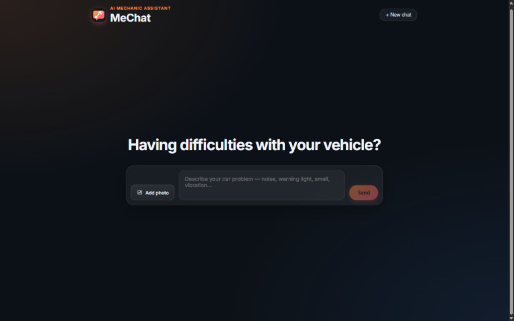
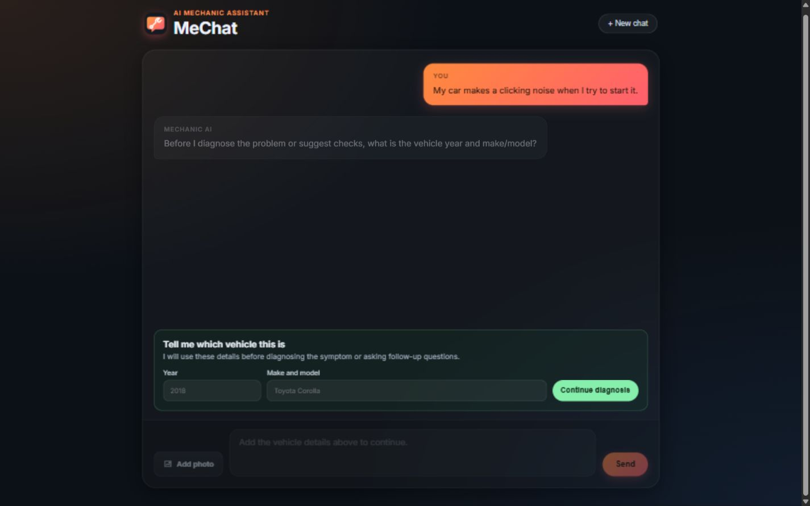
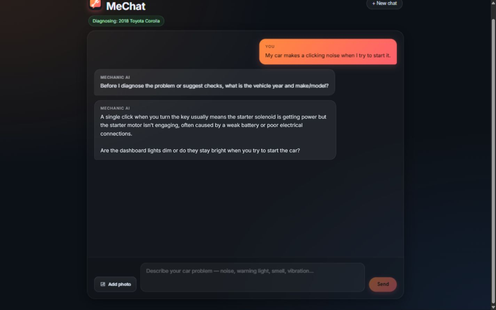
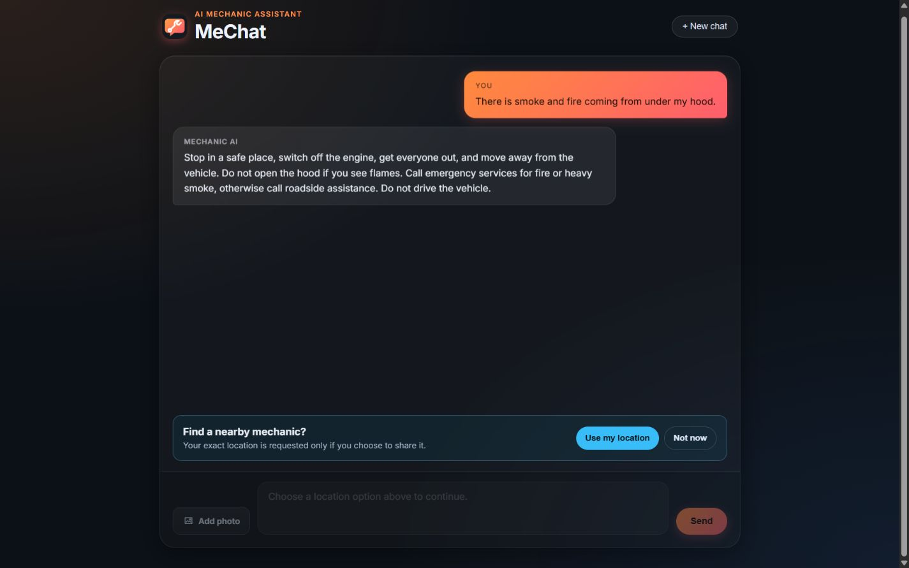
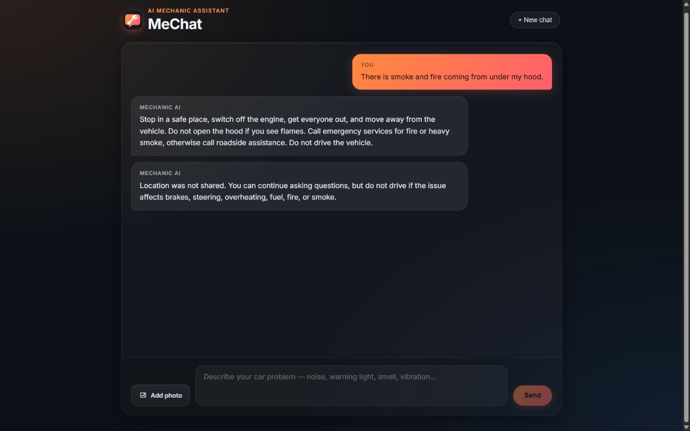
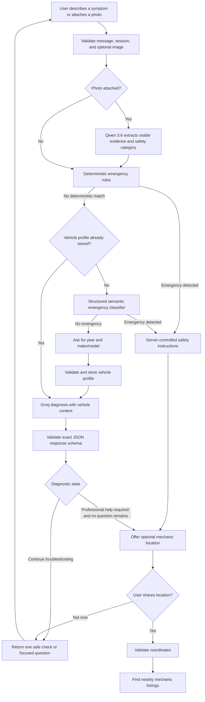
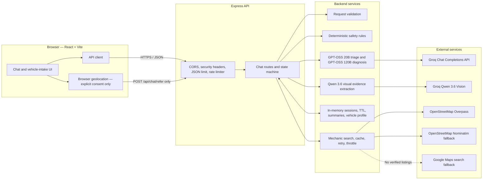

<div align="center">
  
  <h1>MeChat</h1>
  <p><strong>A safety-first, multimodal AI mechanic assistant.</strong></p>
  <p>Built with React, Express, Groq structured outputs, and OpenStreetMap.</p>

  
  
  
  
  
</div>

MeChat helps drivers describe vehicle symptoms, checks for immediate danger before using generative AI, collects vehicle context for more relevant guidance, analyzes uploaded photos, and offers nearby repair shops only when troubleshooting is exhausted or the situation is urgent.

> MeChat provides general guidance, not a guaranteed diagnosis. For brake or steering failure, overheating, fuel leaks, fire, or smoke, stop safely and contact roadside assistance or emergency services.

## Product walkthrough

### Chat-first home screen

<p align="center">
  
</p>

### Vehicle-aware troubleshooting

<table>
  <tr>
    <td width="50%">
      
    </td>
    <td width="50%">
      
    </td>
  </tr>
  <tr>
    <td align="center"><strong>Context collected before advice</strong></td>
    <td align="center"><strong>Focused diagnosis and follow-up question</strong></td>
  </tr>
</table>

### Emergency triage and location privacy

<table>
  <tr>
    <td width="50%">
      
    </td>
    <td width="50%">
      
    </td>
  </tr>
  <tr>
    <td align="center"><strong>Server-controlled emergency guidance</strong></td>
    <td align="center"><strong>Location remains optional</strong></td>
  </tr>
</table>

## Why this project stands out

| Engineering area | Implementation |
|---|---|
| AI safety | Deterministic emergency rules run before model advice, with a second structured semantic triage layer |
| Reliable AI output | Strict JSON Schema responses plus server-side semantic validation and safety overrides |
| Better diagnosis | Vehicle year and make/model are collected after emergency triage and included in later reasoning |
| Multimodal input | Drag-and-drop JPEG, PNG, and WebP analysis with MIME, size, and file-signature validation |
| Privacy | Photos are not retained, GPS requires explicit consent, and coordinates are isolated from normal chat |
| Production thinking | Rate limits, CORS allowlisting, timeouts, retries, caching, bounded sessions, and rolling summaries |
| Verification | 27 automated backend tests plus frontend linting and production-build checks |

## Tech stack

- **Frontend:** React 19, Vite, responsive CSS, accessible file input and full-page drag-and-drop
- **Backend:** Node.js, Express 5, layered service architecture
- **AI:** Groq Chat Completions with GPT-OSS structured outputs and Qwen vision analysis
- **Maps:** OpenStreetMap Overpass and Nominatim, with an honest Google Maps search fallback
- **Testing:** Node's built-in test runner and Oxlint

## Quick start

```bash
git clone <your-repository-url>
cd mechanic-chatbot
npm run install:all
```

Copy `backend/.env.example` to `backend/.env`, add your Groq API key, then start both applications with one command:

```bash
npm run dev
```

- Frontend: `http://localhost:5173`
- Backend: `http://localhost:5000`

Run the complete verification suite with:

```bash
npm test
```

## Features

- Conversational vehicle troubleshooting through the Groq Chat Completions API
- Free-tier model routing: GPT-OSS 20B for triage and GPT-OSS 120B for diagnosis
- Server-validated JSON decisions instead of hidden text control tags
- Strict Groq JSON Schema output for both AI stages
- Layered emergency checks: flexible deterministic rules plus structured semantic classification
- Required vehicle year and make/model intake after the emergency check and before AI advice
- JPEG, PNG, and WebP photo evidence analyzed by Groq Qwen 3.6 Vision
- Explicit location consent with a “Not now” option
- Nearby repair-shop listings through OpenStreetMap Overpass and Nominatim
- Honest Maps search fallback when no listings can be verified
- Expiring, size-limited sessions with bounded context and a rolling summary
- Request size limits, per-IP rate limiting, CORS allowlisting, and security headers
- Timeouts, retries, caching, and `429`/`5xx` handling for external services
- Automated backend safety, validation, session, and API tests

## Safety and AI response flow



The model returns these fields:

```json
{
  "message": "Check the tire pressure before driving farther.",
  "followUpQuestion": "Does the vibration increase with speed?",
  "severity": "medium",
  "action": "continue_cautiously",
  "diagnosticState": "continue_troubleshooting"
}
```

Both configured GPT-OSS models use Groq Structured Outputs with `strict: true`. The model is constrained to the declared JSON Schema, and the backend still validates the parsed values and semantic consistency as a second safety boundary.

Mechanic location is offered only for deterministic emergencies or when `diagnosticState` is `professional_help_required` and no follow-up question remains. If another useful question or safe check exists, the server keeps the conversation in active troubleshooting even if the model mentions that professional inspection may eventually be needed.

## Architecture



### API endpoints

| Endpoint | Responsibility |
|---|---|
| `POST /api/chat/new` | Create an expiring in-memory session |
| `POST /api/chat` | Validate and process a symptom without attaching GPS |
| `POST /api/chat/vehicle` | Store year and make/model, then begin vehicle-aware diagnosis |
| `POST /api/chat/photo` | Validate and analyze a consented vehicle photo without storing the image |
| `POST /api/chat/refer` | Accept consented coordinates and search for mechanics |
| `POST /api/chat/continue` | Decline location sharing and resume troubleshooting |

### Storage boundaries

- Session messages, summaries, pending state, and vehicle profiles live only in the backend's in-memory `Map`.
- Sessions expire after the configured TTL and are lost when the backend restarts.
- GPS coordinates are not stored in the session or sent with ordinary chat messages.
- Uploaded photos are sent to Groq for analysis but are not stored in backend sessions; only text observations enter chat context.
- Mechanic lookup results are cached temporarily in backend memory.
- The Groq API key remains server-side in `backend/.env`.

## Requirements

- Node.js 18 or newer
- A Groq API key from [console.groq.com](https://console.groq.com)
- A real monitored contact email if enabling the public Nominatim fallback

## Setup

### Backend

```bash
cd backend
cp .env.example .env
npm install
npm run dev
```

Set at least:

```env
GROQ_API_KEY=gsk_your_key_here
OSM_CONTACT_EMAIL=your-monitored-email@example.com
```

The backend runs on `http://localhost:5000` by default.

### Frontend

```bash
cd frontend
npm install
npm run dev
```

The frontend runs on `http://localhost:5173` by default. For a separately hosted backend, set `VITE_API_URL` in the frontend environment.

On Windows, `start-dev.bat` starts both applications.

## Environment variables

All backend variables belong in `backend/.env`.

| Variable | Default | Purpose |
|---|---:|---|
| `GROQ_API_KEY` | required | Server-side Groq API key |
| `GROQ_TRIAGE_MODEL` | `openai/gpt-oss-20b` | Fast model for semantic emergency classification |
| `GROQ_DIAGNOSIS_MODEL` | `openai/gpt-oss-120b` | High-capability model for vehicle-aware diagnosis |
| `GROQ_VISION_MODEL` | `qwen/qwen3.6-27b` | Multimodal model used only for photo evidence extraction |
| `GROQ_MAX_TOKENS` | `700` | Maximum completion size |
| `MAX_IMAGE_BYTES` | `4194304` | Maximum decoded photo size (4 MB) |
| `PORT` | `5000` | Backend port |
| `MAX_TURNS` | `5` | Recent conversation turns retained verbatim |
| `MAX_SESSION_TURNS` | `20` | Maximum user messages per session |
| `MAX_MESSAGE_CHARS` | `2000` | Maximum message length |
| `SESSION_TTL_MS` | `3600000` | Inactive-session lifetime |
| `MAX_SESSIONS` | `1000` | In-memory session capacity |
| `MECHANIC_RADIUS_M` | `15000` | Mechanic search radius |
| `MECHANIC_LIMIT` | `3` | Maximum returned listings |
| `MECHANIC_CACHE_TTL_MS` | `300000` | Mechanic-result cache lifetime |
| `EXTERNAL_TIMEOUT_MS` | `10000` | Groq and map-provider timeout |
| `EXTERNAL_MAX_RETRIES` | `2` | Retries for transient failures |
| `RATE_LIMIT_WINDOW_MS` | `60000` | Incoming API rate-limit window |
| `RATE_LIMIT_MAX_REQUESTS` | `30` | Requests allowed per IP/window |
| `ALLOWED_ORIGINS` | `http://localhost:5173` | Comma-separated browser origins |
| `OSM_CONTACT_EMAIL` | empty | Required to enable public Nominatim |

## Location privacy and OpenStreetMap use

- The browser does not request location on page load.
- Chat messages never include coordinates.
- Coordinates are sent only to `/api/chat/refer` after the user clicks **Use my location**.
- Choosing **Not now** clears the pending location request and keeps the chat available.
- Mechanic results are cached, and Nominatim requests are serialized to at most one request per second.
- Nominatim is disabled unless `OSM_CONTACT_EMAIL` is configured.
- OpenStreetMap attribution is displayed with returned OSM listings.

Review the [Nominatim usage policy](https://operations.osmfoundation.org/policies/nominatim/) before production deployment. A commercial application should use a contracted provider or its own geocoding infrastructure instead of relying on the public endpoint.

## API summary

### `POST /api/chat/new`

Creates a session. Sessions expire after inactivity.

### `POST /api/chat`

```json
{
  "sessionId": "uuid",
  "message": "My brake pedal goes to the floor"
}
```

For a non-emergency first symptom, the API returns `needs_vehicle_info` without calling Groq or giving diagnostic advice. Other statuses are `active`, `needs_location`, and `limit`. Safety responses also include `severity` and `action`.

### `POST /api/chat/vehicle`

```json
{
  "sessionId": "uuid",
  "vehicle": {
    "year": 2018,
    "makeModel": "Toyota Corolla"
  }
}
```

The vehicle is stored on the session and included in this and all later Groq diagnostic requests. Engine, trim, transmission, or mileage are requested later only when they materially affect the diagnosis.

### `POST /api/chat/refer`

```json
{
  "sessionId": "uuid",
  "location": { "lat": 30.0444, "lng": 31.2357 }
}
```

Coordinates must be finite JSON numbers within valid geographic ranges. A successful lookup returns `status: "referral"`; the conversation remains available for follow-up questions.

### `POST /api/chat/continue`

```json
{
  "sessionId": "uuid"
}
```

Declines location sharing and resumes the conversation.

## Testing

Run all backend tests:

```bash
cd backend
npm test
```

Run frontend checks:

```bash
cd frontend
npm run lint
npm run build
```

The backend tests do not call Groq or public map APIs. They cover emergency triage, vehicle-intake gating, strict and vision response validation, image type/signature checks, invalid coordinates, zero coordinates, session expiration, rolling history, fallback labeling, and referral consent endpoints.

## Production notes

- The in-memory store is suitable for one local process. Use Redis for multiple instances or durable sessions.
- Add centralized logs and metrics for latency, token use, referral decisions, errors, and safety outcomes.
- Maintain an automotive evaluation set and test every prompt/model change before release.
- Do not log exact GPS coordinates or full conversations unless users explicitly consent and retention is documented.
- Verify model availability in Groq before deployment; model lifecycles can change.

## License

MIT
